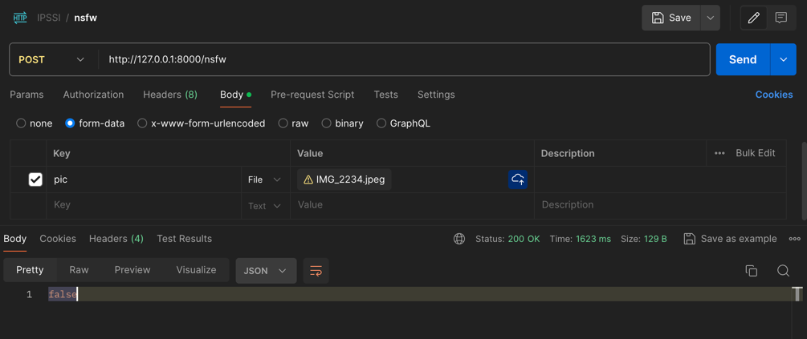
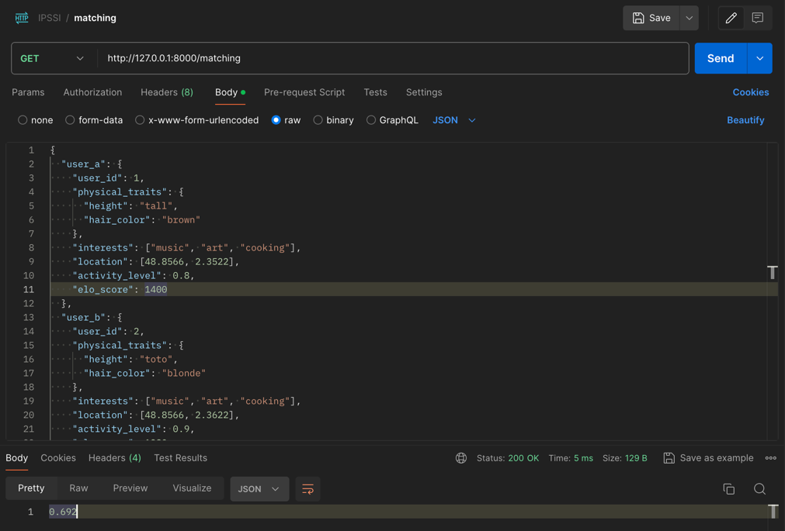

# Modiblove (Clone Tinder)

## Description du projet

Modiblove est un clone de Tinder développé dans le cadre d'un projet IPSSI. Cette application de rencontre s'inspire des 
fonctionnalités clés de Tinder tout en intégrant une plus value en termes de sécurité et de confidentialité...
Nous avons développé notre algorithme de matching, nommé HELLO, pour optimiser les correspondances entre les utilisateurs. 

## Fonctionnalités principales

- Authentification des utilisateurs
- Création et gestion de profils
- Système de swipe (like/dislike) pour les correspondances potentielles
- Chat en temps réel
- Téléchargement de photos
- Algorithme de correspondance (matching Elo)

## Structure du projet
### Backend - _Mohamed_

- Node.js avec Express.js
- TypeScript
- Base de données : MongoDB avec Mongoose

### Frontend - _Nicolas_

- Développement de l'interface utilisateur
- Implémentation des fonctionnalités de swipe

### Algorithmes et Modèles - _Nassim_

- Implémentation de l'algorithme de matching HELLO (basé sur le système Elo)
- Optimisation des correspondances basée sur :
- L'espace géographique (10 km)
- Les préférences physiques
- Développement de modèles pour la détection de contenu inapproprié

## Installation et configuration

### Prérequis
- Installer Node.js
- Installer MongoDB
- Installer les dépendances du projet:
- `npm install`
- Créer un fichier `.env` à la racine du projet et ajouter vos variables d'environnement.

### Configuration des services
#### Backend
- Pour lancer le serveur, exécutez la commande `npm run dev`.

#### Frontend
- Pour lancer l'application frontend, exécutez la commande `npm start`.

#### Algo API
- Pour lancer l'API de l'algorithme, exécutez la commande `make fastapi`.

## Licence

Ce projet est développé dans le cadre d'un cursus éducatif à l'IPSSI. Tous droits réservés.
https://github.com/Nassim-dev/tinder

### Capture du projet

#### Algo

